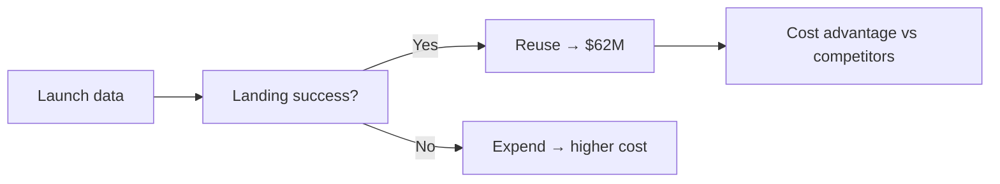
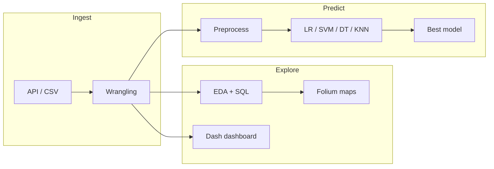

# SpaceX Falcon 9 First Stage Landing Prediction

**Data Science Capstone** — End-to-end pipeline to predict Falcon 9 first-stage landing success from historical launch data.

---

## Executive Summary

SpaceX offers Falcon 9 launches at **$62M** versus **$165M+** for traditional providers. The gap comes from **reusing the first stage**: when the booster lands successfully, it can fly again and keep costs down. This project builds a **predictive pipeline**—from raw launch data to a trained classifier—so stakeholders can estimate **landing success probability** before a mission. That directly supports **cost estimation**, **competitive bidding**, and **mission planning**.

---

## Business Context

| Metric | SpaceX Falcon 9 | Typical Competitors |
|--------|------------------|---------------------|
| **Launch cost** | **$62M** | **$165M+** |
| **Driver** | First-stage reuse | Expendable rockets |
| **Per-launch saving** | ~**$100M+** when reuse works | — |

Predicting first-stage landing success answers: *Will this mission land and reuse, or expend?* That drives **true cost** and **risk** for customers and for SpaceX’s own economics.



---

## Business Insights

### Cost & reuse economics

- **~$100M+ per launch** separates SpaceX’s advertised price from competitors when the first stage is reused. A reliable **success probability** turns into **expected cost** (e.g. 90% success → high confidence in $62M-class pricing).
- **Block 5 boosters** show improved reliability in the data—aligning mission plans and customer expectations with newer hardware reduces surprise and supports long-term pricing strategy.

### Competitive bidding & pricing

- **Bidding against SpaceX** requires estimating *their* cost. This model turns payload, orbit, site, and booster type into a **landing success probability**, which feeds into **expected cost** and whether a competitor can undercut or match.
- **Payload mass and orbit type** are the strongest predictors. Heavier GTO missions tend to use drone-ship (ASDS) landings and have a different success profile than LEO—so **mission design** (orbit + mass) drives both technical and commercial outcomes.

### Risk & mission planning

- **Launch site matters:** CCAFS SLC-40 and KSC LC-39A show higher success rates in the analysis. Choosing where to launch isn’t only operational—it affects **predicted success** and thus **risk and cost**.
- **Success rate improves after ~2017** in the data. Temporal trends reflect learning and hardware evolution; using **time and booster version** in the model captures this and avoids underestimating recent missions.

### Geography & landing strategy

- **Folium-based analysis** shows launch sites near coasts and how **RTLS** (return to launch site) vs **ASDS** (drone ship) varies by location. Geography and infrastructure feed into **which landing strategy** is used and its historical success—useful for logistics and stakeholder communication.
- **Payload–orbit interplay:** GTO missions with heavier payloads typically need ASDS landings. The model’s **feature importance** (e.g. from a Decision Tree) makes this explicit: orbit and payload are **actionable levers** for mission planning.

### From model to decisions

- **Explainable features** (payload mass, orbit, launch site, flight number) let non-ML stakeholders interpret *why* a mission is predicted to succeed or fail—supporting **contracts**, **insurance**, and **internal planning**.
- **Better landing prediction → better cost estimation → stronger competitive positioning.** The pipeline connects data and ML directly to **business value**: pricing, bidding, and risk.

---

## Project Pipeline



- **Data:** SpaceX API + IBM Cloud datasets (payload, orbit, launch site, booster version, outcomes).
- **Wrangling:** Outcome encoding (success/fail), feature engineering, cleaning with **pandas**.
- **EDA & viz:** Summary stats, correlations, **Matplotlib/Seaborn**, **Folium** launch-site maps, **Plotly Dash** dashboard.
- **ML:** Binary classification with **Logistic Regression**, **SVM**, **Decision Tree**, **KNN**; tuning via **GridSearchCV**; evaluation with accuracy, F1, confusion matrix.

---

## Key Analytical Findings

| Finding | Business implication |
|--------|----------------------|
| **Success rate improves after ~2017** | Historical risk is higher for older missions; use time/booster version when estimating cost and success for new launches. |
| **CCAFS SLC-40 & KSC LC-39A** | Highest success rates—prefer these sites in planning and when communicating expected outcomes to customers. |
| **LEO vs GTO** | LEO missions tend to have higher success; GTO requires ASDS landings and has a different risk profile—pricing and risk models should treat orbit explicitly. |
| **Payload mass & orbit** | Top predictive features; mission design (mass + orbit) is the main lever for both technical success and cost/reuse expectations. |
| **Block 5 boosters** | Improved reliability in data—align customer and internal expectations with Block 5 for lower risk and more stable cost estimates. |

**Models:** Logistic Regression (interpretable baseline), SVM (strong accuracy with tuning), Decision Tree (feature importance for explainability), KNN. Best model is chosen on test accuracy/F1; **payload mass, orbit type, launch site, and flight number** consistently drive predictions and can be used in contracts and planning.

---

## Deliverables & Repository Structure

| Item | Description |
|------|-------------|
| `labs-jupyter-spacex-Data wrangling.ipynb` | Data collection & wrangling |
| `edadataviz.ipynb` | EDA & visualizations |
| `jupyter-labs-eda-sql-coursera_sqllite.ipynb` | SQL analysis (SQLite) |
| `lab_jupyter_launch_site_location.ipynb` | Folium maps & launch sites |
| `SpaceX_Machine Learning Prediction_Part_5.ipynb` | ML pipeline & classification |
| `PRESENTATION_SLIDES.md` | Slide content for capstone presentation |

The **Plotly Dash dashboard** lets stakeholders filter by launch site and payload range, view success rates and scatter plots, and explore data without code—turning analysis into day-to-day decision support.

---

## Setup

```bash
# Clone and enter project
git clone <your-repo-url>
cd falcon9

# Optional: create environment and install
pip install pandas numpy matplotlib seaborn scikit-learn folium dash plotly sqlalchemy
```

Run the Jupyter notebooks in order (wrangling → EDA → SQL → maps → ML) for the full pipeline. Data sources: SpaceX API and IBM Cloud datasets referenced in the notebooks.

---

## Takeaways

- **Business:** Landing success probability drives **reuse economics** (~$100M+ per launch vs competitors), **competitive bidding**, **risk and mission planning**, and **customer-facing cost estimates**. Payload, orbit, site, and booster version are actionable levers.
- **Technical:** Full stack from raw data → wrangling → EDA (viz + SQL) → interactive Folium maps & Plotly Dash dashboard → ML classification (LR, SVM, Decision Tree, KNN) with explainable features.
- **Tools:** pandas, SQLite/SQLAlchemy, Matplotlib, Seaborn, Folium, Dash, Plotly, scikit-learn.

*Data Science Capstone — SpaceX Falcon 9 First Stage Landing Prediction.*
